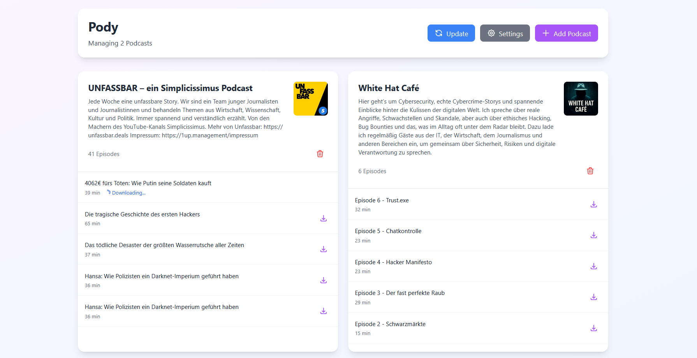

# Pody

🚧 Work in Progress 🚧

**Pody** is a small self-hosted tool to download podcasts from YouTube.

I built it because I bought an **MP3 player** and there was **no easy way to get podcasts onto it**.
With Pody, I can download podcast episodes as MP3 files and listen to them offline on my player.


## Screenshot



*Screenshot of the Pody dashboard.*


## What Pody does

- Downloads podcast episodes from YouTube
- Saves them as audio files (MP3)
- Automatically downloads new episodes

## Why?
I wanted something simple that lets me:
- download podcasts
- copy them to my MP3 player
- listen offline

So I built Pody.


## Status

Pody is still under development and not finished yet.
Things may change and features are missing.


## Setup (early version)
Pody can be self-hosted using Docker Compose.

```yaml
version: '3.8'
services:
  pody:
    build: ghcr.io/notacodes/pody:latest
    container_name: pody
    ports:
      - "8080:8080"
    volumes:
      - ./downloads:/app/downloads
    restart: unless-stopped
   ```
./downloads is the folder where all MP3 files will be saved.
You can change this path to any location where you want your MP3 files to be stored.
